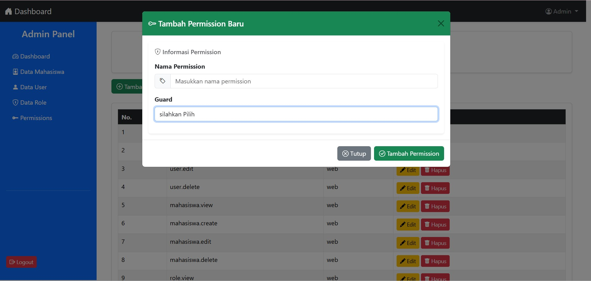
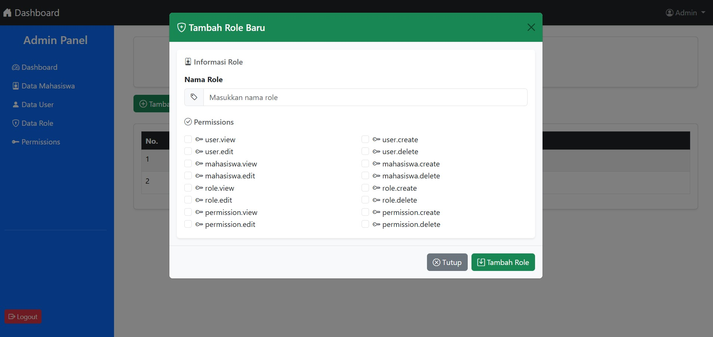
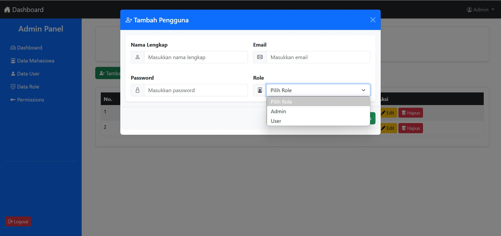
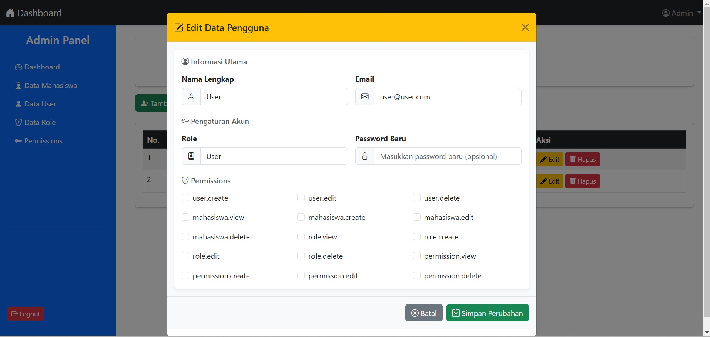

# Example Implementasi Spatie Permission | Laravel + Bootstrap

Contoh implementasi sederhana untuk manajemen Role dan Permission menggunakan package **Spatie Permission** di Laravel. Pada contoh ini, dilakukan pengaturan akses user berdasarkan role dan permission yang dimilikinya.

## Fitur

| Fitur      | Status |
| ---------- | ------ |
| Auth       | ✅     |
| Role       | ✅     |
| Permission | ✅     |

## Package yang Digunakan

| Package               | Deskripsi                                             |
| --------------------- | ----------------------------------------------------- |
| **Laravel/ui**        | Paket UI untuk autentikasi (login, register, dll).    |
| **Spatie/Permission** | Paket untuk manajemen role dan permission di Laravel. |

## Teknologi yang Digunakan

| Komponen     | Teknologi                        |
| ------------ | -------------------------------- |
| **Client**   | HTML, CSS, JavaScript, Bootstrap |
| **Server**   | PHP, Laravel                     |
| **Database** | MySQL                            |

## Source Kode Implementasi

| Source                                          | Status  | Link |
| ----------------------------------------------- | ------- | ---- |
| **Repo Example Implementasi Spatie Permission** | Private | None |

## Deskripsi Spatie Permission

Spatie Permission adalah sebuah package untuk mengelola **roles** dan **permissions** di Laravel. Package ini menggunakan beberapa tabel untuk memetakan hubungan antara model, role, dan permission.

### Tabel Utama yang Digunakan

| Tabel                     | Deskripsi                                                                               |
| ------------------------- | --------------------------------------------------------------------------------------- |
| **roles**                 | Menyimpan data tentang role (misalnya admin, user).                                     |
| **permissions**           | Menyimpan data tentang permission yang ada (misalnya edit artikel, hapus pengguna).     |
| **model_has_roles**       | Tabel pivot yang menghubungkan model (seperti User) dengan role yang dimilikinya.       |
| **model_has_permissions** | Tabel pivot yang menghubungkan model (seperti User) dengan permission yang dimilikinya. |
| **role_has_permissions**  | Tabel pivot yang menghubungkan role dengan permission yang dimilikinya.                 |

## Metode Penggunaan

### A. Pengelolaan Role

| Fungsi                         | Deskripsi                                                                       |
| ------------------------------ | ------------------------------------------------------------------------------- |
| `Role::create()`               | Digunakan untuk membuat role baru di tabel **roles**.                           |
| `assignRole()`                 | Menambahkan role ke user dan menyimpannya di tabel **model_has_roles**.         |
| `syncRoles()`                  | Menyinkronkan role yang dimiliki user, menggantikan role lama dengan yang baru. |
| `removeRole()`                 | Menghapus role tertentu dari user di tabel **model_has_roles**.                 |
| `Role::findByName()->delete()` | Menghapus role berdasarkan nama.                                                |

### B. Pengelolaan Permission

| Fungsi                               | Deskripsi                                                                                                                    |
| ------------------------------------ | ---------------------------------------------------------------------------------------------------------------------------- |
| `Permission::create()`               | Digunakan untuk membuat permission baru di tabel **permissions**.                                                            |
| `givePermissionTo()`                 | Memberikan permission tertentu ke role atau user, disimpan di tabel **role_has_permissions** atau **model_has_permissions**. |
| `syncPermissions()`                  | Menyinkronkan permission yang dimiliki oleh role atau user, menggantikan permission lama dengan yang baru.                   |
| `revokePermissionTo()`               | Menghapus permission tertentu dari role atau user.                                                                           |
| `Permission::findByName()->delete()` | Menghapus permission dari tabel **permissions** ketika tidak lagi diperlukan.                                                |

### C. Penghubungan Role dan Permission

| Fungsi                    | Deskripsi                                                                                          |
| ------------------------- | -------------------------------------------------------------------------------------------------- |
| `givePermissionTo()`      | Memberikan permission ke role, disimpan di tabel **role_has_permissions**.                         |
| `syncPermissions()`       | Menyinkronkan permission role, hanya menyimpan permission yang baru dan menghapus permission lama. |
| `Role::hasPermissionTo()` | Mengecek apakah role memiliki permission tertentu.                                                 |

### D. Mengecek Role dan Permission

| Fungsi              | Deskripsi                                          |
| ------------------- | -------------------------------------------------- |
| `hasRole()`         | Mengecek apakah user memiliki role tertentu.       |
| `hasPermissionTo()` | Mengecek apakah user memiliki permission tertentu. |
| `getRoleNames()`    | Mendapatkan daftar role yang dimiliki oleh user.   |

## Ringkasan Kondisi Penggunaan

| Tindakan                                | Fungsi / Metode                      |
| --------------------------------------- | ------------------------------------ |
| **Membuat role baru**                   | `Role::create()`                     |
| **Menambahkan role ke user**            | `assignRole()`                       |
| **Menyinkronkan role user**             | `syncRoles()`                        |
| **Menghapus role dari user**            | `removeRole()`                       |
| **Membuat permission baru**             | `Permission::create()`               |
| **Memberikan permission ke role**       | `givePermissionTo()`                 |
| **Memberikan permission ke user**       | `givePermissionTo()`                 |
| **Menyinkronkan permission role/user**  | `syncPermissions()`                  |
| **Menghapus permission dari role/user** | `revokePermissionTo()`               |
| **Menghapus role**                      | `Role::findByName()->delete()`       |
| **Menghapus permission**                | `Permission::findByName()->delete()` |

## Screenshots

**Tambah Permission**  

**Tambah Role dan Permission**  

**Tambah Role ke User**  

**Tambah Permission ke User**  

## Feedback

Silahkan berikan feedback atau Ingin mendapatkan Source, Silahkan Hubungi Email Dibawah ini :

